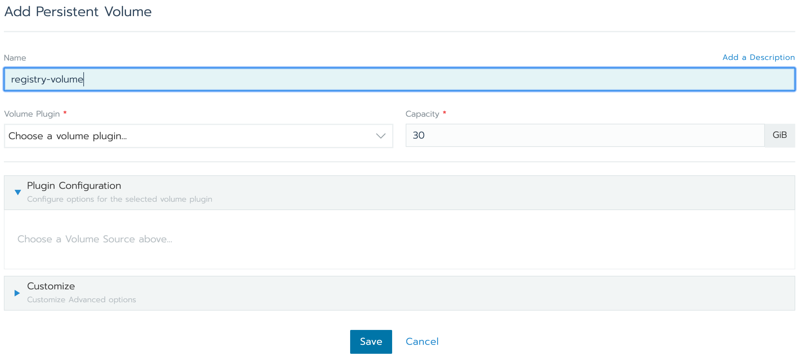

# Docker Registry

To create a private registry inside the cluster, browse the apps catalog and find the `Docker Registry` app. Make sure you are using the chart **from Library**.


You will be presented with the configuration options.


First we setup basic auth. Create a user/pass with `htpasswd`.

```
$> htpasswd -Bbn user password
user:$2y$05$MafeuUzA1PqzVi1czGSaleIcuciqufiv3uYmEqK9ReA2yeKYozq7K
```

And paste that in the `Docker Registry Htpasswd Authentication` field.


Enable Persistent Volume and set the volume size appropriately.  
We chose to make the registry available only inside the cluster, so we disabled the load balancer option and set the service type to `ClusterIP`.

Next, in your cluster dashboard, go to `Storage > Persistent Volumes`.


And set the size and name of the Volume to be used by the registry.


